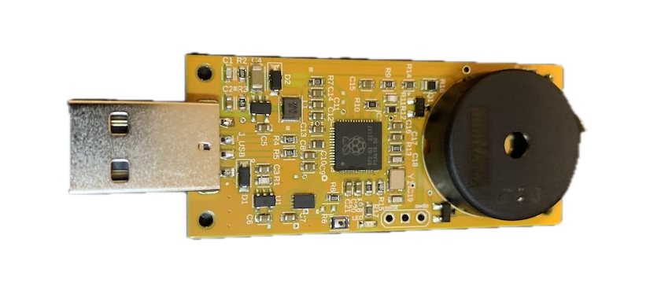

# Klickerd

### A USB gadget that sounds an alarm when your NAS is compromised

## Hardware

The hardware consists of a piezo speaker, overvolted to 25 V to produce crisp "clicks" similar to a Geiger counter.  

## Software

The software is a Python script that notifies the USB gadget when high disk activity is detected.

### Flashing to a new Raspberry Pi Pico with CircuitPython

1. Download the latest CircuitPython UF2 for the Raspberry Pi Pico from the official CircuitPython website.
2. Hold the **BOOTSEL** button on the Pico while plugging it into your computer over USB.
3. The Pico will appear as a removable drive named **RPI-RP2**.
4. Copy the downloaded `.uf2` file to the **RPI-RP2** drive. The Pico will reboot automatically and appear as a new
   drive named **CIRCUITPY**.
5. Copy the contents of the `gadget/` folder to the **CIRCUITPY** drive.
6. Safely eject the drive or unplug the Pico.

After that, the device should boot into CircuitPython and run the gadget automatically.

